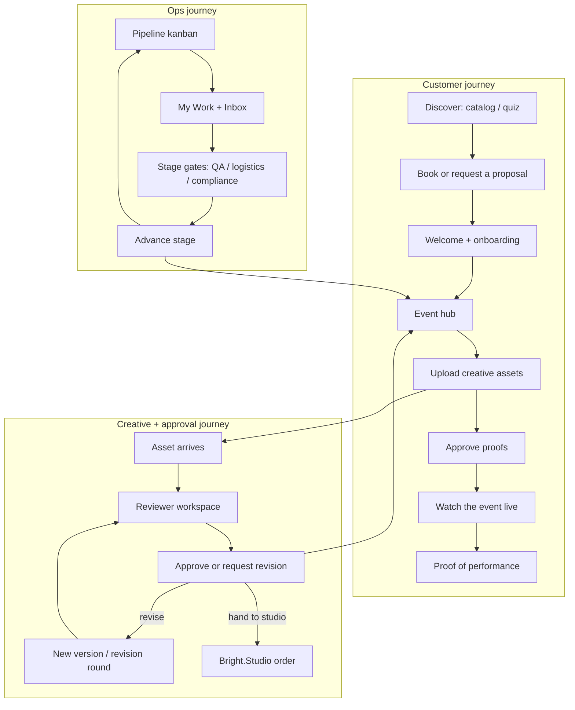

# Bright.Experience

The delivery-and-proof portal for Bright.Blue Events — one workspace to run an
activation from kickoff through live telemetry to post-event proof of performance.
Catalog, quiz, and quoting are the **intake** path that feeds delivery; partner and
venue portals are secondary growth surfaces.

The product is organised around journeys, not screens. Every surface earns its
place in one of three flows below, rendered on a single, consistent **Cloud**
design system.

## The three journeys



- **Customer** — discovery → booking/proposal → onboarding → event hub (assets, approvals, tasks, messages, live, leads, reports).
- **Creative + approval** — customer uploads land in the creative review queue (`/admin/asset-reviews`), where each asset is checked against its spec, previewed on the machine, and approved or sent back with a note. Paid creative help routes through Bright.Studio.
- **Ops** — the delivery pipeline kanban (`/pipeline`), per-user work (`/inbox`, focus list on `/`), and the 10 delivery stages with their QA / logistics / compliance gates.

## Tech Stack

| Layer | Technology |
|-------|-----------|
| **Framework** | Next.js 16 (App Router, React 19, TypeScript) |
| **Styling** | Tailwind CSS v4 + shadcn/ui, semantic CSS-variable tokens |
| **Database** | Supabase (Postgres with Row-Level Security) |
| **Auth** | Supabase Auth (email/password, invites, session management) |
| **Storage** | Supabase Storage (private buckets, signed URLs) |
| **Live updates** | Polling (20s `AutoRefresh`) fed by inbound Cloud webhooks — Supabase Realtime is not used today (see `docs/11-cloud-handoff.md` D1) |
| **Email** | Resend (transactional + digest notifications) |
| **Telemetry** | Bright.Blue Cloud (live API poll + inbound webhooks) |
| **CRM** | Pipedrive (outbound write-back) |
| **Observability** | Sentry (client / server / edge) |
| **Validation** | Zod (form and API validation) |
| **Charts** | Recharts (theme-aware Cloud chart kit) |
| **Motion** | Framer Motion (page transitions, count-ups, stagger) |
| **Icons** | Lucide React |

## Getting Started

### Prerequisites

- Node.js 20+ (22 recommended — enforced via the `engines` field in `package.json`)
- npm 9+
- Docker Desktop (for the local Supabase stack) or a hosted Supabase project

### Setup — local Postgres (recommended)

This is the runtime that behaves like production: real auth, real RLS, real
PostgREST, real constraints. Use it for anything touching security, policies, or
a new query shape.

```bash
git clone <repo-url>
cd Bright.Experience

npm install

npm run db:local    # start Supabase in Docker, apply migrations, seed users + data
npm run dev:local   # dev server wired to that stack, mock mode off
```

Both scripts pull the anon and service-role keys straight out of the Supabase
CLI, so a restarted stack keeps working without editing `.env.local`. Related
commands:

```bash
npm run db:reset          # wipe and re-seed when the data drifts
npm run db:stop           # stop the containers
npm run test:rls          # pgTAP policy suite against the local stack
npm run test:integration  # hot read path, run as real personas
```

### Setup — hosted Supabase

```bash
npm install
cp .env.example .env.local   # fill in your project URL and keys
npx supabase db push
npx tsx supabase/seed-users.ts
npx tsx supabase/run-seed.ts
npm run dev
```

### Setup — mock mode (no database)

`npm run dev` with `NEXT_PUBLIC_MOCK_MODE=1` (already set in `.env.development`)
runs the whole app against the in-memory dataset in `src/lib/supabase/mock/`.
Ideal for UI work and demos, but it accepts any password and bypasses RLS
entirely, so it proves nothing about whether the real database will accept a
query. Production builds ignore the flag and log a security error.

Open [http://localhost:3000](http://localhost:3000) to view the app.

Day-1 CTO notes: [`HANDOFF.md`](./HANDOFF.md).

### Environment Variables

| Variable | Tier | Purpose | If missing |
|---|---|---|---|
| `NEXT_PUBLIC_SUPABASE_URL` | **Required** | Supabase project URL | App cannot auth or read/write |
| `NEXT_PUBLIC_SUPABASE_ANON_KEY` | **Required** | Supabase anon key | App cannot auth or read/write |
| `NEXT_PUBLIC_SITE_URL` | **Required** | Canonical site URL for email links & auth redirects | Broken magic links / redirects |
| `SUPABASE_SERVICE_ROLE_KEY` | **Required** | Service-role client for crons, webhooks, invites, admin scans | Crons / webhooks / invites throw |
| `RESEND_API_KEY` | Recommended | Transactional + digest email | Emails logged to console, skipped |
| `BRIGHTBLUE_API_KEY` + `BRIGHTBLUE_API_URL` | Recommended | Live Cloud telemetry poll | Live dashboard falls back to DB |
| `BRIGHTBLUE_WEBHOOK_SECRET` | Recommended | HMAC verify on inbound telemetry webhooks | Inbound telemetry rejected (503) |
| `NEXT_PUBLIC_SENTRY_DSN` | Recommended | Error reporting (prod) | Sentry disabled |
| `CRON_SECRET` | Optional | Bearer auth on `/api/cron/*` | Cron routes 401 |
| `NEXT_PUBLIC_CALCOM_LINK` | Optional | Cal.com event-type path for the inline walkthrough booker | Built-in preset slot picker renders instead |
| `CALCOM_WEBHOOK_SECRET` | Optional | HMAC verify on inbound Cal.com booking webhooks | Cal.com webhooks rejected (503) |
| `PIPEDRIVE_API_TOKEN` | Optional | CRM write-back | No-op (or falls back to DB config) |
| `FROM_EMAIL` / `STUDIO_TEAM_EMAIL` / `SALES_TEAM_EMAIL` | Optional | Email addresses | Defaults to `@brightblue.co.uk` |
| `BOOKING_AUTO_PROVISION` | Optional | Set `"true"` (production only) to auto-create accounts/events/invites on public booking | Bookings recorded, provisioning skipped |
| `FILE_SCAN_URL` / `FILE_SCAN_TOKEN` | Optional | Malware scan on uploads (`src/lib/storage/scan.ts`) | Scan skipped — uploads pass unscanned |
| `NEXT_PUBLIC_MOCK_MODE` | Optional | Set `"1"` to run entirely against the in-memory mock dataset (`src/lib/supabase/mock/`) — no Supabase project needed. Set in `.env.development`; ignored (with a logged error) in production builds | Falls back to a live Supabase project (the four Required vars) |

See `.env.example` for the full list with setup instructions, and
[`SETUP.md`](./SETUP.md) for three step-by-step setup paths (mock demo, local
Supabase, hosted Supabase).

## Architecture Principles

- **Pages compose, components render, actions mutate, queries read** — strict separation of concerns.
- **Server Components by default** — `"use client"` only when interactivity is needed.
- **Row-Level Security** — the database enforces access boundaries, not just application code.
- **shadcn/ui primitives** — all standard UI uses shadcn; domain components compose them. Never hand-roll a `.btn`/`.card`/`.badge`/`.input`.
- **Zod validation** — every form input validated client-side and in Server Actions.
- **Keep files focused** — prefer small, single-purpose modules; most files stay well under ~300 lines. Large domains are split into focused files (e.g. types live in per-domain modules under `src/types/`, re-exported from `src/types/index.ts`). A handful of registry/data and dashboard files run longer by design.

## Project Structure

```
src/
├── app/                    # Next.js App Router pages and API routes
│   ├── actions/            # Server Actions (mutations) grouped by domain
│   ├── (public)/           # Public pages (catalog, book, proposal, quiz, report)
│   ├── events/[id]/        # Event workspace (overview, assets, approvals, live, reports, …)
│   ├── partners/[slug]/    # Partner portal (dashboard, clients, commissions)
│   ├── venues/[slug]/      # Venue portal (dashboard, placements, sponsorships)
│   ├── admin/              # Internal tools (quotes, asset reviews, partners, campaigns, invoices, API)
│   ├── pipeline/           # Ops delivery kanban
│   ├── inbox/              # Cross-event assigned work
│   ├── studio/             # Internal studio dashboard
│   ├── p/[code]/           # Partner attribution redirect
│   ├── api/                # Route handlers (live, export, search, webhooks, crons)
│   └── login/              # Authentication
├── components/
│   ├── ui/                 # shadcn/ui primitives (do not modify directly)
│   ├── cloud/              # Cloud design-system kit (see Design System below)
│   ├── brand/              # Page chrome: EditionShell, RidgeHero, Admin/EventPageShell, RidgeArtwork
│   ├── layout/             # Sidebar AppShell, command palette, user menu, notifications
│   ├── assets/             # Upload zone, machine preview, asset rows
│   ├── admin/              # Review queue + internal work surfaces
│   ├── telemetry/          # Live counters, charts, lead tables
│   ├── reports/            # Proof of performance and reporting
│   └── …                   # events, quotes, briefing, approvals, qa, logistics, partners, venues, campaigns
├── lib/
│   ├── queries/            # Supabase read queries (one file per entity)
│   ├── validations/        # Zod schemas (one file per domain)
│   ├── supabase/           # Client config (browser + server + service-role)
│   ├── notifications/      # Unified notification spine (dispatch, archetypes, email shell)
│   ├── brightblue/         # Cloud telemetry client
│   ├── asset-requirements/ # Game-flow asset specs + on-machine placement previews
│   ├── roles.ts        # Role & permission helpers (single source of truth)
│   └── …                   # auth, dates, env, surfaces, exports
├── types/index.ts          # TypeScript types and enums (stages, statuses, entities)
└── middleware.ts           # Auth middleware and route protection

supabase/
├── migrations/             # Database migrations (applied in order)
├── schema.sql              # Canonical schema reference
├── seed-users.ts           # Auth user seeding
└── run-seed.ts             # Application data seeding

docs/                       # Product documentation (see Documentation below)
```

## Design System — "Cloud"

Bright.Experience uses the **Cloud** design language: calm, premium, light-first, built on solid surfaces and a polished slate dark mode. Design tokens live in [`src/app/globals.css`](src/app/globals.css) and map onto shadcn/ui's semantic variable system, so primitives pick up theme switches automatically.

### Themes

- **Light (default)** — cool slate-50 ground, white cards, slate hairlines. The default for the authenticated portal.
- **Dark ("Cloud Slate")** — deep slate ground, cobalt accents.

The theme is a single `.theme-light` class toggled on `<html>` by [`ThemeProvider`](src/components/theme/ThemeProvider.tsx), persisted to `localStorage`, with an inline FOUC guard.

### The Cloud kit (`src/components/cloud/`)

| Primitive | Purpose |
|-----------|---------|
| `PageHeader` / `Eyebrow` | Standard page title block (cobalt eyebrow, title, subtitle, actions) |
| `KpiGrid` / `KpiCard` | Responsive KPI tiles with delta + trend |
| `GlassCard` / `GlassCardHeader` | The signature solid card surface + section header |
| `ChartCard` / `CloudBarChart` / `CloudAreaChart` | Theme-aware Recharts wrappers (read live CSS vars) |
| `DataTableShell` / `Column` | Generic table inside a card, with toolbar + empty state |
| `FilterPill` / `SegmentedControl` | Toolbar filters and segment toggles |
| `StatusPill` / `EmptyState` | Status chips and empty-state placeholders |
| `PdfCanvas` | Client-side PDF rendering for asset previews |

### Page chrome (`src/components/brand/`)

| Primitive | Purpose |
|-----------|---------|
| `EditionShell` + `EditionChrome` + `RidgeHero` + `EditionBody` + `EditionFooter` | The page chassis every authenticated surface composes |
| `EventPageShell` | Wraps `EditionShell` for any `/events/[id]/*` sub-page |
| `AdminPageShell` | Same shape for internal `/admin/*` and adjacent pages |
| `EditionPlate` | Compact card for a single event in list views |
| `RidgeArtwork` | The deterministic "maze of lines" SVG fingerprint |

### The ridge ("maze of lines")

The ridge is Bright.Blue's signature. It appears as a **faint whisper in page heroes only** (`RidgeHero variant="compact"`) and as the loud editorial moment on marketing / login surfaces — never as full-page background noise.

### Typography

- **Display & headings** — Nunito (`--font-heading`)
- **Body** — DM Sans (`--font-body`)
- **Overline / metadata** — DM Sans Medium, tracked (`text-overline`)

Font files live in `public/fonts/`, wired in [`src/app/layout.tsx`](src/app/layout.tsx).

### Motion

Framer Motion primitives in [`src/components/ui/motion.tsx`](src/components/ui/motion.tsx): `PageTransition`, `FadeIn`, `Stagger` / `StaggerItem`, and `AnimatedCounter` for KPI count-ups.

### Component rules

- Every authenticated page uses a shell (`EditionShell` / `AdminPageShell` / `EventPageShell`) — never a one-off layout.
- Use shadcn primitives for all standard UI; `<Badge variant="success|warning|destructive|info|muted">`, `<Button variant="brand">`, `<Card interactive>`.
- One generative ridge per page (the hero).
- Use the legal radii tokens, never ad-hoc `rounded-2xl`/`rounded-3xl`.
- No emoji in UI unless explicitly requested.

## Delivery stages

The 10-stage delivery pipeline (`Stage` in [`src/types/index.ts`](src/types/index.ts)):

`confirmed → kickoff_complete → creative_assets → approvals → build_configuration → qa_readiness → logistics_confirmed → event_live → reporting → complete`

Stage advancement is gated by blocking tasks/milestones (`canAdvanceStage` in [`src/app/actions/stages.ts`](src/app/actions/stages.ts)), and emits notifications + Pipedrive write-back.

## Roles

| Role | Type | Access |
|------|------|--------|
| `customer_user` | External | Own event delivery access |
| `customer_admin` | External | Delivery + team + reporting + sign-off |
| `events_lead` | Internal | Event management (admin-equivalent for ops) |
| `creative_lead` | Internal | Creative / studio management + asset reviews |
| `operations_lead` | Internal | Operations and logistics |
| `qa_lead` | Internal | Quality assurance |
| `admin` | Internal | Full platform access (includes technical configuration) |
| `partner_member` / `partner_admin` | Partner | Partner portal access + management |

## Available Scripts

| Command | Description |
|---------|-------------|
| `npm run dev` | Start development server (port 3000, mock mode) |
| `npm run dev:local` | Development server wired to the local Postgres stack |
| `npm run db:local` | Start local Supabase, apply migrations, seed users + data |
| `npm run db:reset` | Wipe and re-seed the local database |
| `npm run db:stop` | Stop the local Supabase containers |
| `npm run build` | Production build |
| `npm run start` | Start production server |
| `npm run lint` | Run ESLint |
| `npm run typecheck` | Type-check (`tsc --noEmit`) |
| `npm test` | Unit tests (Vitest, mocked Supabase) |
| `npm run test:watch` | Vitest watch mode |
| `npm run test:coverage` | Coverage report |
| `npm run test:integration` | Hot read path against local Postgres as real personas |
| `npm run test:rls` | pgTAP RLS tests (Docker / Supabase CLI) |
| `npm run test:e2e` | Playwright end-to-end tests |

One-off utilities (not npm scripts):

| Command | Description |
|---------|-------------|
| `npx tsx scripts/provision-informa-pp.ts` | Idempotent upsert of the Informa portfolio pricing page into the live DB (needs `NEXT_PUBLIC_SUPABASE_URL` + `SUPABASE_SERVICE_ROLE_KEY` in the environment; the canonical seed is the matching migration) |
| `node scripts/informa-report-pdf/generate.mjs` | Regenerate `public/downloads/Bright.Blue-Informa-Sample-Report.pdf` from its HTML source (Playwright screen-mode pipeline) |
| `node scripts/generate-world-dots.mjs` | Regenerate `public/pitch/map/world-dots.svg` (the Informa deck's dotted world map) from Natural Earth land data; its geographic crop must match `MAP_BOUNDS` in `src/lib/informa/portfolio-shows.ts`, which a test enforces |

## Documentation

Start at the index — [`docs/00-documentation-index.md`](./docs/00-documentation-index.md) —
which routes you by role (stakeholder, engineer, CTO, operator, product owner)
and lists every document. Highlights:

**Onboarding:** [`SETUP.md`](./SETUP.md) (setup paths) ·
[`HANDOFF.md`](./HANDOFF.md) (Day-1 CTO) · [`CONTRIBUTING.md`](./CONTRIBUTING.md)

**Product & design (`docs/`):**
- **01 Product Definition** — what the platform is, who it serves, success criteria
- **02 Event Lifecycle** — the 10-stage delivery pipeline with health tracking
- **03 Roles & Permissions** — access control matrix (mirrors `src/lib/roles.ts`)
- **04 Data Model** — entity relationships and field definitions
- **05 Information Architecture** — route map and navigation
- **06 Build Roadmap** — phased delivery plan
- **07 Platform Vision** — catalog, quoting, partners, venues
- **08 Pricing & Quoting Model** — the implemented two-track + capability model
- **09 Design System** — the Cloud language reference and banned patterns
- **12 UX Simplification Audit** — role-by-role UX audit (resolved)

**Architecture, integrations & reference:**
- **10 Integrations** — webhooks, crons, external systems
- **11 Cloud Handoff** — authoritative schema + Cloud integration notes
- **13 Dev Handover Priorities** — prioritised worklist + security checklist
- **14 Codebase Map** — directory taxonomy, tooling, inventories
- **15 System Architecture** — diagrams and data flows
- **16 API & Actions Reference** — route handlers + server actions
- **17 Feature Reference** — role-based feature catalogue

**Operations:** [`docs/ops/`](./docs/ops/README.md) — deployment, integration
activation, monitoring/security/DR, maintenance/troubleshooting.

## Production Checklist

Before going live, verify every item:

1. **Required env** — all `Required`-tier variables set in the hosting provider (Vercel project settings).
2. **`NEXT_PUBLIC_SITE_URL`** — set to the production domain, not localhost.
3. **`SUPABASE_SERVICE_ROLE_KEY`** — set server-side only; never exposed to the browser.
4. **Supabase Auth** — redirect URLs configured to match the production domain.
5. **Resend** — domain verified, `RESEND_API_KEY` set, `FROM_EMAIL` on the verified domain.
6. **Cron secrets** — `CRON_SECRET` set in Vercel, matching Bearer auth on `/api/cron/*`.
7. **Bright.Blue Cloud** — `BRIGHTBLUE_WEBHOOK_SECRET` set, webhook URL registered; `BRIGHTBLUE_API_URL`/`BRIGHTBLUE_API_KEY` set for live poll.
8. **Sentry** — `NEXT_PUBLIC_SENTRY_DSN` set (and `SENTRY_ORG`/`SENTRY_PROJECT` for source-map upload in CI).
9. **Database migrations** — `npx supabase db push` applies everything in `supabase/migrations/`.
10. **Stubs** — review `STUBS-TO-REPLACE.md` and replace any launch-blocking stubs (e.g. virus scan endpoint).
11. **Legal copy** — `/privacy` and `/terms` contain reviewed legal text, not placeholders.
