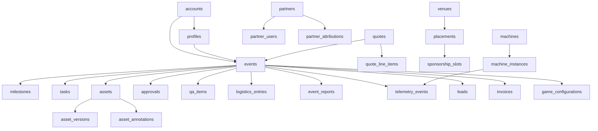

# 11 — Cloud & Dev-Team Handoff Register

> **Purpose.** This is the single source of truth for everything the engineering team (Pradeep + dev team) needs to wire, provision, and build to take Bright.Experience from its current state into a production cloud deployment. It captures the full database, all file/data storage, every external integration and environment variable, the deferred features that need real backend wiring, and the known tech debt — each with the **what**, the **why**, the **how**, and the **acceptance criteria**.
>
> **In plain English.** The portal works today against a local/dev setup. To run it "for real" in the cloud, the team needs to (1) stand up the database and file storage, (2) plug in a handful of outside services with their secret keys, (3) finish a few features that depend on cloud infrastructure we don't own locally, and (4) clean up a short list of known rough edges. This document tells them exactly how, in order.

**Owner:** Bright.Blue product/engineering · **Audience:** CTO + dev team · **Status:** living document, update as items land.

---

## How to read this document

- **Part A — Cloud provisioning runbook:** the step-by-step to get the app live (database, storage, auth, env, cron, integrations).
- **Part B — Data model reference:** the complete database schema, grouped by domain, with row-level security (RLS) and relationships.
- **Part C — Data & file storage:** every storage bucket, upload flow, and non-database persistence.
- **Part D — Deferred features to build:** the roadmap items that require cloud infrastructure or dev-team ownership, each with full build notes.
- **Part E — Known tech debt & loose ends:** corrections to make before or shortly after go-live.
- **Part F — Go-live acceptance checklist.**

Every claim cites a file path so the team can jump straight to the code.

---

# Part A — Cloud Provisioning Runbook

Provision in this order; later steps depend on earlier ones.

### A1. Supabase project (database + auth + storage + realtime)
- Create a **Postgres 17** cloud project (the repo pins `db.major_version = 17` in `supabase/config.toml`). A lower version will fail migrations.
- Run every migration in `supabase/migrations/` in timestamp order (46 files). They create all tables, RLS policies, functions, triggers, storage buckets, and seed data.
- Seed users with `supabase/seed-users.ts` + `supabase/run-seed.ts` (these read `NEXT_PUBLIC_SUPABASE_URL` + `SUPABASE_SERVICE_ROLE_KEY`).
- Note: catalog rows (`machines`, `games`, etc.) referenced by the rename/gallery migrations are **not created by migrations** — they come from `supabase/seed.sql`. Run the seed file too, or those `UPDATE ... WHERE id = <fixed uuid>` statements no-op.
- Set the three core env vars (see A5).

### A2. Storage buckets
Migrations create all five buckets and their `storage.objects` RLS policies, but the team must confirm them and raise one limit:
- Buckets: `event-assets` (private), `briefings` (private), `reports` (private), `studio-deliverables` (private, reserved/not yet wired), `catalog-media` (public).
- **Raise the project storage `file_size_limit` to >= 200 MB.** `supabase/config.toml:114` sets 50 MiB, but the app permits 200 MB for `briefings`/`studio-deliverables`. Without this, large briefing/studio uploads are rejected by Supabase even though the app's own validator allows them.

### A3. Supabase Auth (dashboard settings — `config.toml` values are dev-only)
- **Site URL** = production `NEXT_PUBLIC_SITE_URL`.
- **Redirect allow-list** must include `https://<domain>/auth/callback` (and preview-deploy URLs). The auth flow exchanges a code at `src/app/auth/callback/route.ts`.
- **Custom SMTP:** point Supabase Auth email (invite / recovery / magic-link) at Resend SMTP. Important: `RESEND_API_KEY` covers *app* emails only — **Supabase Auth emails are sent by Supabase's own SMTP**, not Resend, unless you wire it.
- **Email templates:** customise invite / reset / confirmation in the dashboard (no repo-managed templates exist).
- **Policy:** decide `enable_confirmations` and password length for prod (local defaults are permissive — 6-char min, confirmations off). Raise the auth email rate limit (local is 2/hour).

### A4. Vercel deployment + cron
- Set all env vars (A5). Vercel Cron is a Pro-plan feature; schedules are UTC.
- `vercel.json` defines 3 crons: `/api/cron/reminders` (daily 09:00), `/api/cron/digest` (daily 17:00), `/api/cron/pipedrive` (hourly).
- **Action:** `/api/cron/reports` exists (`src/app/api/cron/reports/route.ts`) and is `CRON_SECRET`-authed but is **not scheduled in `vercel.json`** — add a schedule or it will never run.
- Ensure `next/image` remote hosts in `next.config.ts` match your real storage/CDN domains.
- Add a `SENTRY_AUTH_TOKEN` (Vercel Sentry integration) for source-map upload.

### A5. Environment variables

**Required (app will not function without these):**
- `NEXT_PUBLIC_SUPABASE_URL`, `NEXT_PUBLIC_SUPABASE_ANON_KEY` — non-null-asserted in `src/lib/supabase/{client,server}.ts` and `src/middleware.ts`; missing = crash.
- `NEXT_PUBLIC_SITE_URL` — canonical URL for email links + auth redirects (`src/app/layout.tsx`, `src/app/actions/invites.ts`).
- `SUPABASE_SERVICE_ROLE_KEY` — privileged key for crons/invites/webhooks (`src/lib/supabase/service-role.ts`); throws clearly if missing.

**Recommended (features degrade gracefully if unset):**
- `RESEND_API_KEY` (+ `FROM_EMAIL`, `STUDIO_TEAM_EMAIL`, `SALES_TEAM_EMAIL`) — email; logs to console when unset.
- `CRON_SECRET` — protects cron routes.
- `BRIGHTBLUE_API_URL`, `BRIGHTBLUE_API_KEY`, `BRIGHTBLUE_WEBHOOK_SECRET` — live telemetry in/out.
- `SENTRY_DSN` *(note: dead — see E)*, `NEXT_PUBLIC_SENTRY_DSN`, `SENTRY_ORG`, `SENTRY_PROJECT` — error tracking + source maps.
- `FILE_SCAN_URL` (+ `FILE_SCAN_TOKEN`) — upload malware scanning (fails open when unset).
- `PIPEDRIVE_API_TOKEN`, `PIPEDRIVE_BASE_URL`, `NEXT_PUBLIC_PIPEDRIVE_WEB_BASE_URL` — CRM (prefers the DB `pipedrive_config` row).
- `BOOKING_AUTO_PROVISION` — set `"true"` **only in production** to auto-create accounts/events/invites on booking.

**Missing from `.env.example` (add them):** `SENTRY_ORG`, `SENTRY_PROJECT` (used in `next.config.ts`). Also `TEST_MODE` (E2E only).

### A6. External integrations — see Part D2 for per-service setup
Resend, Sentry, Pipedrive, Bright.Blue Cloud (webhook + REST), optional file-scan AV, and Puppeteer/Chromium for PDF generation.

---

# Part B — Data Model Reference (complete schema)

50 tables across 17 domains. Source: the files in `supabase/migrations/` (56 at last count — trust the folder over this number).

**Project-wide conventions:**
- **RLS helper functions** (`security definer stable`): `is_internal_user()` (true for staff roles: `events_lead, creative_lead, operations_lead, qa_lead, developer, admin`), `user_account_id()` (caller's `profiles.account_id`), `user_partner_id()` (caller's `partner_users.partner_id`). Defined in `20260403000000_initial_schema.sql` and `20260403000007_partner_tables.sql`.
- **`update_updated_at()` trigger** auto-stamps `updated_at` on UPDATE. Originally only eight tables had it; `20260529000000_add_missing_updated_at_triggers.sql` backfills every remaining table that carries the column.
- Customers get SELECT/INSERT/UPDATE within their account scope only; **no customer DELETE policies exist anywhere** (destructive ops are internal-only or cascade via FK).

### Relationship overview

### Domain 1 — Identity & Accounts
- **`accounts`** (`initial_schema`) — the customer brand/tenant. `id, name, slug UNIQUE, logo_url`. RLS: customers see own (`id = user_account_id()`); internal manage all.
- **`profiles`** (`initial_schema`) — one row per `auth.users`. Key cols: `role user_role`, `account_id -> accounts`, `is_active`, `has_completed_onboarding` (027200005), `current_streak`/`last_active_date` (028200000). RLS: self-view + internal-all. **Auto-created** by `handle_new_auth_user()` trigger on `auth.users` insert (reads role/account from invite metadata).

### Domain 2 — Events & Lifecycle
- **`events`** (`initial_schema`) — central engagement record. Cols include `account_id`, `event_type`, `package_type`, `current_stage event_stage`, `health_status`, `template_id`, `pipedrive_deal_id`. RLS: customers see own account's; internal CRUD.
- **`milestones`** (`initial_schema`) — lifecycle checkpoints (no `updated_at`).
- **`tasks`** (`initial_schema`) — to-dos; `assigned_role`/`target_path` added (027200004). Customer-visible + assigned tasks updatable by customer.
- **`event_templates`** (`delivery_lifecycle`) — JSON blueprints (milestones/tasks/assets/qa/compliance/config). Internal-only. 3 seeded.
- **`event_team_members`** (`027200002`) — customer-added teammates w/ pending/approved/removed workflow. *(No `updated_at` trigger.)*
- **`handoff_notes`** (`communication_hub`) — internal stage-to-stage handover notes (internal-only RLS).
- **`comments`** (`027200003`) — threaded comments on event or asset (self-ref `parent_id`).

### Domain 3 — Assets & Creative
- **`assets`** (`initial_schema`) — deliverable file slots. Two review tracks: legacy `status asset_status` + newer `review_status` (`pending_review/approved/revision_requested`, from notification_spine). Rich spec cols (028200003). Customer upload UPDATE restricted to non-final statuses.
- **`asset_versions`** (`020260604`) — full revision history, `UNIQUE(asset_id, version)`.
- **`asset_annotations`** (`020260604`) — region-anchored review pins (x/y/w/h as %).
- **`studio_requests`** (`initial_schema`) — Bright.Studio creative orders; `source_asset_id` added. Customer create/update restricted by status.
- **`studio_pricing`** (`027000001`) — published price tiers (public read). 6 rows seeded.

### Domain 4 — Approvals
- **`approvals`** (`initial_schema`) — formal customer sign-off gates; `preview_assets uuid[]`, `revision_count`.
- **`briefing_responses`** (`initial_schema`) — briefing form answers, `UNIQUE(event_id, form_type)`, `responses jsonb`.

### Domain 5 — QA & Readiness
- **`qa_items`** (`delivery_lifecycle`) — pre-go-live checklist; `created_by` added (028200001).

### Domain 6 — Logistics & Venue/Runway
- **`logistics_entries`** (`delivery_lifecycle`) — delivery/setup/collection lines; vendor coordination cols added (028200006).
- **`venue_requirements`** (`028200006`) — venue-imposed requirements (10 types). *(No `updated_at` trigger.)*
- **`venues`** (`venue_runway`) — host locations; partner-owned scoping via `user_partner_id()`.
- **`placements`** (`venue_runway`) — a machine at a venue for a date range.
- **`sponsorship_slots`** (`venue_runway`) — bookable sponsor windows (FK fixed to `accounts` in `schema_reconcile`).
- **`venue_packages`** (`venue_runway`) — venue-sold packages, optionally bundling a Bright.Blue `package`. *(No `updated_at`.)*

### Domain 7 — Quoting / Commercial
- **`quotes`** (`quoting_engine`) — the 3-track (standard/proposal/book_now) quote/proposal record. Heavily evolved; **final `status` allow-list** (`020260606`): `draft, submitted, preparing, walkthrough_scheduled, proposal_sent, delivered, accepted, expired, declined`. Legacy/duplicate columns dropped in `20260713000001` (E2). `proposal_content jsonb`, `engagement_scope`, `addons jsonb` (GIN). RLS: public INSERT (anon prospect submissions), customers see own account.
- **`quote_line_items`** (`quoting_engine`) — priced lines.
- **`locations`** (`quoting_engine`) — postcode-prefix -> pricing tier lookup (public read).
- **`prospect_sessions`** (`quoting_engine`) — anonymous funnel sessions (public create/read).
- **`invoices`** (`028200004`) — issued invoices; RLS retro-added in `029000001`. *(No `updated_at` trigger.)*
- **`account_payment_preferences`** (`028200004`) — per-account finance defaults. *(No `updated_at` trigger.)*

### Domain 8 — Catalog (public storefront)
- **`machines`**, **`games`**, **`machine_games`** (M:N), **`packages`**, **`package_addons`** (`capability_slug` added), **`case_studies`** — all in `catalog_tables`. Public read of active/bookable/published rows; internal CRUD. *(Catalog tables have `updated_at` but no triggers — see E1.)* Rows seeded via `seed.sql`; renames/galleries in `027200006`/`027200007`.

### Domain 9 — Telemetry / Live Event
- **`machine_instances`** (`telemetry_tables`) — serial-tracked physical units. `current_placement_id` FK added in `20260713000002` (E6).
- **`telemetry_events`** (`telemetry_tables`) — raw machine event stream (play/lead/heartbeat/error).
- **`leads`** (`telemetry_tables`) — captured leads.
- **`event_metrics_snapshot`** (`telemetry_tables`) — daily aggregates, `UNIQUE(event_id, snapshot_date)`, `is_final` added.
- **`hourly_metrics`** (`schema_fixes`) — hour-of-day breakdown (written by the `report.ready` webhook).

### Domain 10 — Reporting
- **`event_reports`** (`reporting_tables`) — shareable reports; `share_token UNIQUE`; **public read when `is_published AND share_token is not null`**.
- **`benchmarks`** (`reporting_tables`) — aggregate performance benchmarks (customers read all).
- **`scheduled_exports`** (`028200009`) — recurring export schedules; permissive policy replaced by internal-only in `029000001`. *(No `updated_at` trigger.)*

### Domain 11 — Notifications & Messaging
- **`notifications`** (`delivery_lifecycle`) — in-portal items; `kind/priority/entity_*/action_required` added (notification_spine). Users see/mark-read own.
- **`notification_preferences`** (`notification_spine`) — per-user/per-kind `in_portal` + `email_mode` (immediate/digest/off). PK `(user_id, kind)`. *(No `updated_at` trigger.)*
- **`notification_reminders`** (`notification_spine`) — dedup ledger for the reminder cron.
- **`messages`** (`delivery_lifecycle`) — event chat; `is_internal` flag gates customer visibility; `topic` added (028200007).

### Domain 12 — Partners & Reseller Portal
- **`partners`** (`partner_tables`) — reseller/venue/agency orgs; `partner_code UNIQUE`; public can apply (INSERT) and read active. *(This migration also adds `partner_member`/`partner_admin` to `user_role`.)*
- **`partner_users`** (`partner_tables`) — membership join, `UNIQUE(partner_id, profile_id)`.
- **`partner_attributions`** (`partner_tables`) — commission/credit on a quote or event (pending/approved/paid).

### Domain 13 — Intelligence & Scale
- **`campaigns`**, **`campaign_events`** (M:N) — multi-event campaign grouping (FKs fixed to `accounts`).
- **`recommendations`** — ML/heuristic cache (public read, used by quiz).
- **`api_keys`** — hashed programmatic keys (account/partner scoped).
- **`webhook_subscriptions`** — outbound webhook registrations.

### Domain 14 — Pipedrive Integration
- **`pipedrive_outbox`** (`pipedrive_integration`) — durable queue of pending CRM writes (drained by hourly cron).
- **`pipedrive_config`** (`pipedrive_integration`) — singleton (`id=1`) holding API token + custom-field key mappings. *(No `updated_at` trigger.)*

### Domain 15 — Compliance
- **`compliance_documents`** (`compliance_vault`) — per-event docs (insurance/DPA/RAMS) w/ expiry; RLS retro-added `029000001`. *(No `updated_at` trigger.)*
- **`client_compliance_requirements`** (`compliance_vault`) — per-account default compliance profile, `UNIQUE(account_id, document_type)`. *(No `updated_at` trigger.)*

### Domain 16 — Machine / Game Configuration
- **`game_configurations`** (`game_product_config`) — per-event game setup (prizes/form fields/params), `UNIQUE(event_id)`. *(No `updated_at` trigger.)*
- **`product_configurations`** (`game_product_config`) — per-event product/sampling + `machine_config_json` (lanes/vend). `UNIQUE(event_id)`. *(No `updated_at` trigger.)*

### Domain 17 — Audit
- **`audit_entries`** (`initial_schema`) — append-only log; any authenticated user can INSERT, internal SELECT, no update/delete.

### Database functions
`is_internal_user()`, `user_account_id()`, `user_partner_id()`, `update_updated_at()`, `handle_new_auth_user()`. **All business logic lives in the app layer (server actions)** — there are no other stored procedures.

### Enums (Postgres types)
`event_stage`, `health_status`, `event_type`, `package_type`, `user_role` (incl. partner roles), `task_status/type/category/priority`, `milestone_status`, `asset_status`, `approval_status`, `studio_request_status` (incl. `confirmed`), `studio_service_type`. Everything else uses `text` + inline `CHECK ... IN (...)`.

> A full column-by-column inventory (every type, default, index, and policy predicate) is available; if the team wants it inlined here or as a generated ERD, regenerate from `supabase/migrations/`.

---

# Part C — Data & File Storage

**In plain English.** Beyond the database, the app keeps files in private Supabase "folders" (buckets). Files always upload through the server (optionally virus-scanned) and are read back through short-lived secure links — never public URLs. The canonical helper is `src/lib/storage/signed-url.ts`.

### C1. Buckets

| Bucket | Stores | Public | Read | Limits (app-enforced in `validateUpload`) |
|---|---|---|---|---|
| `event-assets` | Creative uploads, compliance docs, message attachments | No | `createSignedReadUrl` (1h; 7d for message attachments) | 50 MB; png/jpeg/webp/svg/pdf/mp4/quicktime |
| `briefings` | Brand kits, decks, fonts, references | No | signed (1h) | 200 MB; any MIME |
| `reports` | Exported PDFs + scheduled CSV/Excel/PDF | No | signed (7d) | 10 MB; pdf only |
| `studio-deliverables` | Studio final deliveries | No | helper only — **no live caller yet** | 200 MB; png/jpeg/webp/pdf/mp4/quicktime/svg |
| `catalog-media` | Public catalog imagery | **Yes** | public | — |

Bucket creation + `storage.objects` policies live in `20260403000000_initial_schema.sql` (`event-assets`), `20260403000010_schema_reconcile.sql` (briefings/reports/studio-deliverables), `20260403000003_catalog_tables.sql` (catalog-media).

### C2. Upload paths & flows
- Path scheme (`storagePathFor`, `src/lib/storage/signed-url.ts:128`): `{eventId}/{entityType}/{entityId}/{ts}-{sanitisedFilename}`. The DB row stores the **path**, not a URL, so links are re-signed on demand.
- Flows (all server actions, no browser-direct uploads):
  - `uploadAsset` — `src/app/actions/assets.ts:35` -> `event-assets`
  - compliance vault — `src/app/actions/compliance.ts` -> `event-assets`
  - `uploadBriefingFile` — `src/app/actions/briefing.ts:179` -> `briefings`
  - message attachments — `src/app/actions/messages.ts` -> `event-assets`
  - scheduled exports — `src/app/actions/scheduled-exports.ts:255` -> `reports`
  - cron reports — `src/app/api/cron/reports/route.ts:119` -> `reports`
- Malware scan (`src/lib/storage/scan.ts`): POSTs bytes to `FILE_SCAN_URL`, expects `{clean, signature?}`. **Fails open** (down scanner does not block). Tighten to fail-closed if required.

### C3. Other persistence
- **Cookies:** `bb_partner` partner-attribution cookie (`httpOnly`, `secure` in prod, 30-day) set in `src/app/(public)/p/[code]/page.tsx`; Supabase auth cookies via `@supabase/ssr` (`src/middleware.ts`).
- **localStorage (client only):** theme preference, onboarding tour state. No provisioning needed.
- **In-memory (NOT durable / NOT shared):** the rate limiter `Map` in `src/lib/rate-limit.ts` — see Part D3.
- **No Redis / KV / Edge Config** anywhere today.

### C4. Image + PDF
- `next/image` remote hosts allow-listed in `next.config.ts`: `*.supabase.co/storage/**`, `*.supabase.in/storage/**`, `images.unsplash.com`, `api.qrserver.com` (external QR images), `cdn.brightblue.com`. Add any custom CDN/storage domain or `next/image` breaks.
- Server-side PDF via Puppeteer + `@sparticuz/chromium` (`src/lib/exports/pdf.ts`). On serverless ensure sufficient memory + `maxDuration` (proposal-pdf sets 60s).

---

# Part D — Deferred Features to Build (dev-team owned)

These are the roadmap items that depend on cloud infrastructure or backend systems the dev team owns. Each has: what, why, current state, build notes, acceptance.

### D1. Real-time / Live Event Mode (roadmap #3) — **DEFERRED to dev team**
- **What / why.** Today every "live" surface re-polls every 20s (`src/components/system/AutoRefresh.tsx`). The signature promise — live counters, live approvals/messages — should push the instant data changes. The live numbers originate from Bright.Blue Cloud machines, so this is dev-team/CTO territory.
- **Current state.** Zero Supabase Realtime in the app (no `.channel()` / `postgres_changes`). Live data arrives via the inbound webhook `POST /api/webhooks/brightblue` (`src/app/api/webhooks/brightblue/route.ts`) writing `telemetry_events`/`leads`/`machine_instances`/metrics with the service-role client.
- **Build notes.** (1) Add the relevant tables to the `supabase_realtime` publication. (2) Build a `useRealtimeRefresh(table, filter)` client hook subscribing to `postgres_changes`, keeping `AutoRefresh` as fallback. (3) Confirm RLS still scopes realtime payloads per account/event. (4) Apply first to Live Mode (`LiveDashboardClient`, `LiveCounter`, `MachineStatusCard`), then notifications + messages. (5) Wire/confirm the outbound Cloud API (`src/lib/brightblue/client.ts`) and `BRIGHTBLUE_API_*` envs.
- **Acceptance.** A telemetry/lead webhook event reflects on the live dashboard within ~1s without a manual refresh, for the correct event only.

### D2. External service wiring (cloud accounts + keys) — **DEFERRED to dev team**
- **Resend** (`src/lib/email.ts`): verify sending domain (SPF/DKIM), set `RESEND_API_KEY`. Until then emails console-log.
- **Sentry** (`sentry.*.config.ts`, `next.config.ts`): create project, set `NEXT_PUBLIC_SENTRY_DSN` + `SENTRY_ORG` + `SENTRY_PROJECT` + a `SENTRY_AUTH_TOKEN` for source maps. Active only in production.
- **Pipedrive** (`src/lib/pipedrive/*`): configure token + custom-field/pipeline mapping via `/admin/integrations/pipedrive`, or `PIPEDRIVE_API_TOKEN`. Drains hourly via `pipedrive_outbox`.
- **Bright.Blue Cloud:** set `BRIGHTBLUE_WEBHOOK_SECRET` and register `https://<domain>/api/webhooks/brightblue` in Cloud; set `BRIGHTBLUE_API_URL`/`BRIGHTBLUE_API_KEY` for outbound pulls.
- **File-scan AV (optional):** stand up a ClamAV REST shim, set `FILE_SCAN_URL`/`FILE_SCAN_TOKEN`.

### D3. Distributed rate-limit store (roadmap #1 cloud half) — **DEFERRED to dev team**
- **What / why.** `src/lib/rate-limit.ts` is an in-memory token bucket. On Vercel each serverless instance has its own memory, so limits leak across instances and reset on cold start. For real protection it needs a shared store.
- **Build notes.** Back `checkRateLimit` with **Upstash Redis** (or Vercel KV) behind the same function signature so callers don't change. The app-side wiring is **done** — the limiter guards login/reset (`authLimiter`), quote intake + booking (`quoteLimiter`), proposal-page decisions (`decisionLimiter`), and partner apply (`applicationLimiter`). Only the shared store remains.
- **Acceptance.** Rate limits hold across instances and survive cold starts.

### D4. Product analytics (roadmap #5) — **DEFERRED to dev team**
- **What / why.** No analytics tool is integrated (PostHog/Segment/etc.). Without it there is no funnel/usage data (quiz -> proposal -> booking, asset-upload completion).
- **Build notes.** Add a PostHog provider in `src/app/layout.tsx` + a thin `track(event, props)` wrapper; env-gated, no-op when unset (mirror the Resend pattern). Needs a PostHog account/key.
- **Acceptance.** The quiz->proposal->booking funnel is queryable end-to-end.

### D5. Notification craft (roadmap #10) — **partially deferred**
- Timezone/quiet-hours on the digest (`src/app/api/cron/digest/route.ts` fixed 17:00 UTC) and Resend bounce/delivery webhooks. The cron/code changes are buildable now; the Resend webhook registration is cloud setup.

### D6. Reserved-but-unbuilt
- `studio-deliverables` bucket + `createSignedUploadUrl` helper exist with **no caller** — the future Bright.Studio delivery hand-back feature.
- ~~`VenuePackageBuilder` create action unwired~~ — **wired** (`createVenuePackage` in `src/app/actions/venues.ts`, called from `src/components/venues/VenuePackageBuilder.tsx`).

---

# Part E — Known Tech Debt & Loose Ends

> Struck-through items are **resolved** — kept here (with the fixing migration/
> file) so you don't re-investigate them.

1. ~~**`updated_at` columns with no trigger.**~~ **Resolved** by `20260529000000_add_missing_updated_at_triggers.sql` — attaches `set_updated_at` to every remaining table with an `updated_at` column (idempotent `do $$` loop).
2. ~~**Deprecated/duplicate `quotes` columns.**~~ **Resolved** by `20260713000001_drop_legacy_quotes_columns.sql` — drops `footfall_estimate` (int), `location_postcode`, `dates_start/end`, `valid_until`, `budget_indication` in favour of `footfall_estimate_text`, `postcode`, `event_date_start/end`, `expires_at`, `engagement_scope`. All code/seed references were removed in the same change set.
3. **Workstream tables got RLS a day late.** `20260529000002_rls_workstream_tables.sql` retro-fits RLS onto the 028200002-era tables (compliance/invoices/configs/venue_requirements/handoff_notes) that briefly shipped exposed. Net state is correct. *(File renamed from `…000001` — it originally shared a version number with `notification_digest_timing`, which broke `supabase db reset` on fresh clones.)*
4. **`scheduled_exports`** originally had a permissive `using(true)` policy — replaced by internal-only. Don't reintroduce.
5. **`studio_pricing`** original write policy used a non-existent `auth.jwt() ->> 'user_role'` claim — replaced with `is_internal_user()`.
6. ~~**`machine_instances.current_placement_id`** has no FK.~~ **Resolved** by `20260713000002_machine_instances_placement_fk.sql` — adds the FK (couldn't exist at creation; `placements` is created three migrations later) + index, and widens the `telemetry_events.event_type` allow-list to the vocabulary the webhook/UI already handle.
7. ~~**`/api/cron/reports` not scheduled** in `vercel.json`.~~ **Resolved** — all four crons are scheduled (see `vercel.json`).
8. ~~**`.env.example` drift** around Sentry vars.~~ **Resolved** — `.env.example` documents `NEXT_PUBLIC_SENTRY_DSN`/`SENTRY_ORG`/`SENTRY_PROJECT`/`SENTRY_AUTH_TOKEN`, and `docs/10-integrations.md` §8 lists them.
9. **`ALTER TYPE ... ADD VALUE`** (e.g. `20260403000001` adds `confirmed`) cannot run inside a transaction block on some runners — relevant to the migration tooling.
10. **Catalog rows depend on `seed.sql`** — rename/gallery migrations `UPDATE` fixed UUIDs that only exist if the seed ran.
11. **RLS hardening for `qa_items` + `event_reports`** shipped in `20260713000000_rls_qa_reports_hardening.sql`: customer SELECT on `qa_items` dropped (internal-only tool), customer SELECT on `event_reports` now requires `is_published = true`. pgTAP: `rls_qa_items.test.sql`, updated `rls_reports.sql`.
12. **Session middleware exempts machine-to-machine paths.** `/api/webhooks/*` and `/api/cron/*` are in the middleware public list (`src/middleware.ts`) — they enforce their own auth (HMAC / `CRON_SECRET`). Don't remove them from the list or signed webhooks 307 to `/login`.

---

# Part F — Go-Live Acceptance Checklist

- [ ] All 56 migrations + `seed.sql` + `seed-users.ts` applied to a Postgres-17 cloud project (`supabase db reset` proves the chain locally).
- [ ] 5 storage buckets present; project `file_size_limit` >= 200 MB.
- [ ] Supabase Auth: prod Site URL + redirect allow-list + custom SMTP (Resend) + email templates + password/confirmation policy + raised email rate limit.
- [ ] All required env vars set in Vercel; recommended ones set per enabled feature. `NEXT_PUBLIC_SITE_URL` must be the production domain — the auth callback pins redirects to it (`src/lib/auth/safe-redirect.ts`).
- [ ] All 4 crons live (`vercel.json`), `CRON_SECRET` set.
- [ ] Bright.Blue Cloud webhook registered with matching `BRIGHTBLUE_WEBHOOK_SECRET`; outbound API reachable. Prove the pipe with `npx tsx scripts/simulate-cloud-webhook.ts` before pointing real machines at it.
- [ ] Resend domain verified; a test notification email delivers.
- [ ] Sentry receiving events + source maps uploading.
- [ ] Pipedrive token + field mapping configured; outbox drains.
- [ ] `next/image` remote hosts match real storage/CDN.
- [ ] Rate limiter backed by a distributed store (Upstash/KV) — the limiter is already invoked on login/reset, quote intake, booking, proposal decisions, and partner apply; only the shared store remains (Part D3).
- [ ] (Optional) File-scan AV reachable; decide fail-open vs fail-closed.
- [ ] Remaining Part E items triaged (9, 10 are informational; the rest are resolved).
