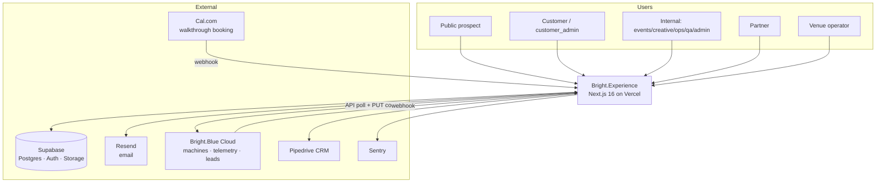
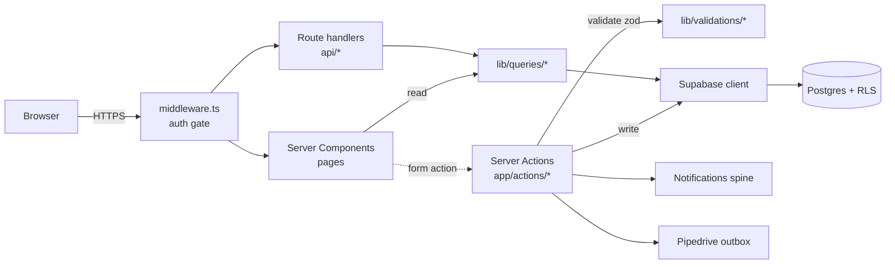
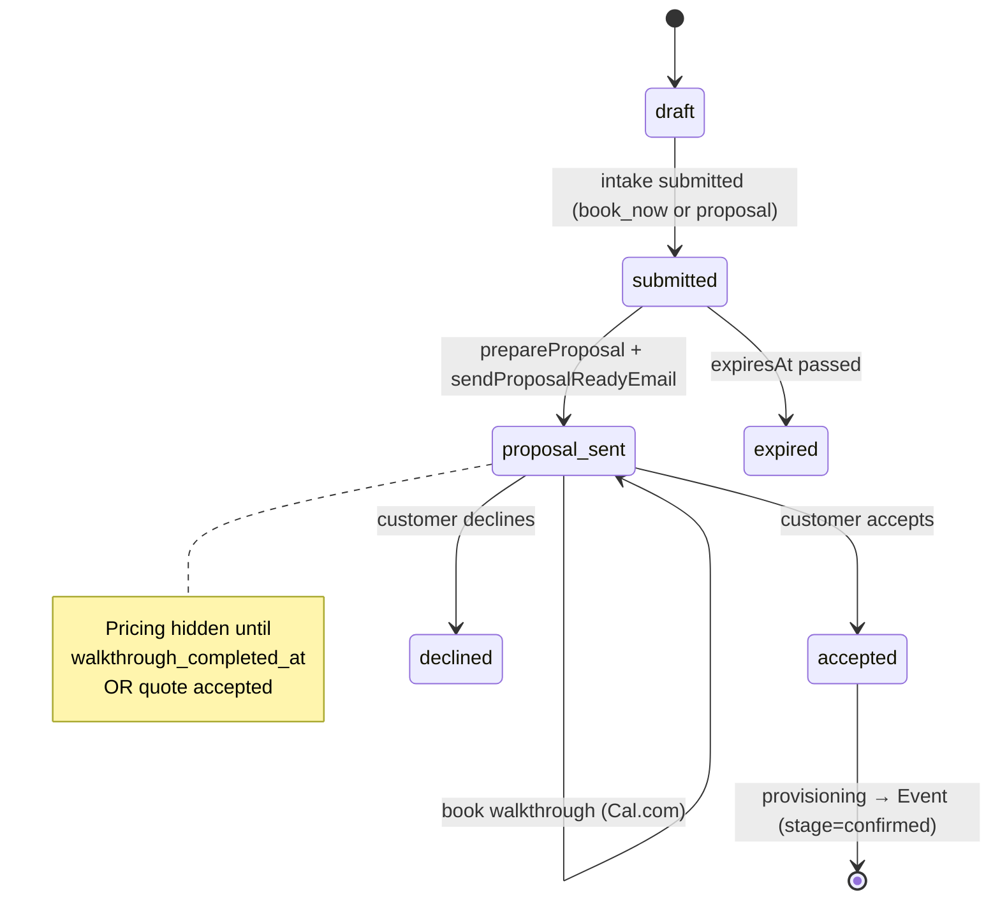
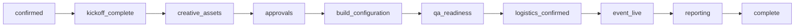
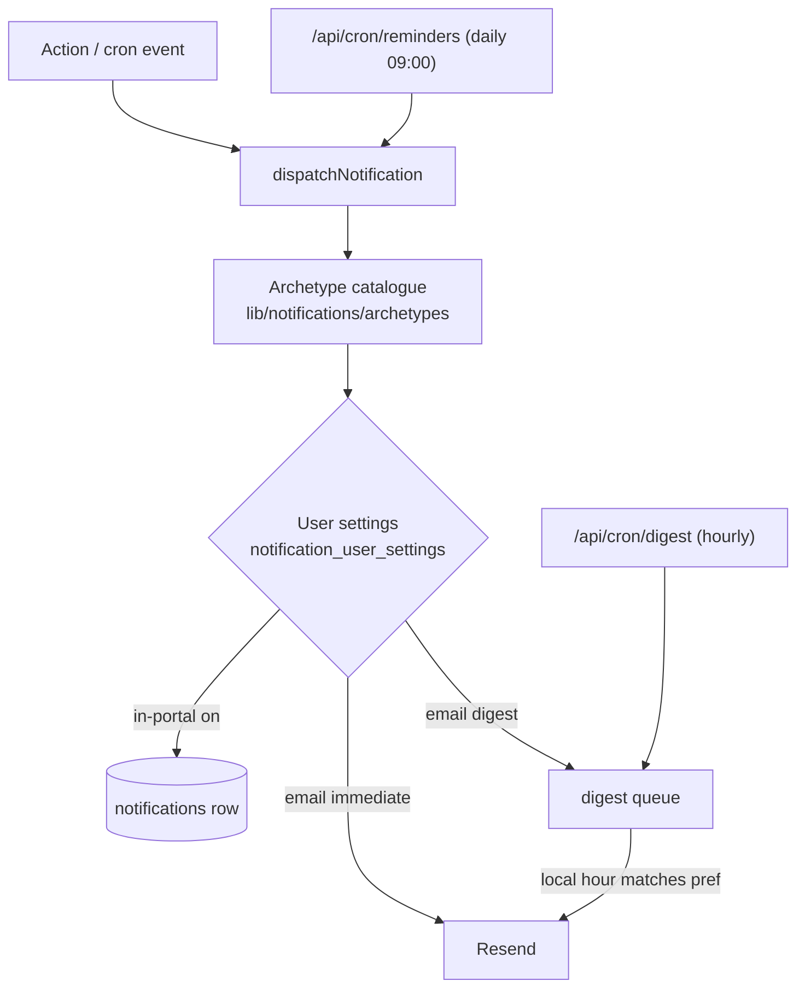
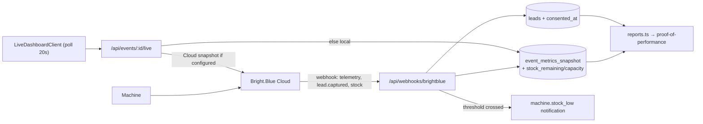
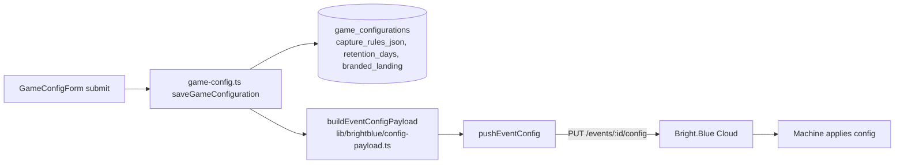
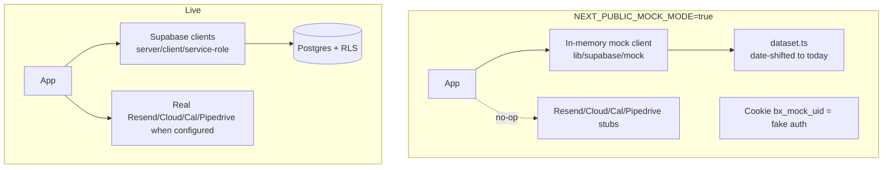

# 15 — System Architecture

> **Version:** 0.1.0 · **Status:** current · **Owner:** Platform ·
> **Last verified:** 2026-07-25 against `main`.
>
> Diagrams of how Bright.Experience is put together and how data moves through
> it. Pairs with [`docs/14-codebase-map.md`](14-codebase-map.md) (structure) and
> [`docs/16-api-and-actions-reference.md`](16-api-and-actions-reference.md)
> (endpoints). Diagrams are Mermaid; they render on GitHub and in most IDEs.

## 1. System context



## 2. Runtime containers & request path



The app is RSC-first: pages fetch through `lib/queries/*` and render; mutations
go through server actions, which validate (Zod), check permissions
(`roles.ts` / `event-access.ts`), write via Supabase, then fan out to the
notifications spine and Pipedrive outbox. RLS is the last line of defence at
the database.

## 3. Authenticated vs. self-authenticating requests

```mermaid
flowchart TB
    subgraph "Session-authenticated (cookie)"
      U[User] --> M[middleware.ts]
      M -->|valid session| PG[Page / API]
      M -->|no session| LOGIN[/login redirect/]
      PG --> RLS1[RLS scopes rows to user]
    end

    subgraph "Self-authenticating (no session)"
      VC[Vercel Cron] -->|Bearer CRON_SECRET| CR[/api/cron/*]
      CR -->|mismatch/unset| F1[401 fail-closed]
      EXT[Cal.com / Cloud] -->|HMAC signature| WH[/api/webhooks/*]
      WH -->|bad/unset secret| F2[401 / 503 fail-closed]
    end
```

Cron and webhook routes carry no user session; they authenticate themselves
(`requireCron` / HMAC) and **fail closed** — see
[`docs/16-api-and-actions-reference.md`](16-api-and-actions-reference.md).

## 4. Quote → proposal → walkthrough → provisioning lifecycle



`QuoteStatus` values: `draft · submitted · proposal_sent · accepted · declined ·
expired` ([`src/types/quotes.ts`](../src/types/quotes.ts)). Acceptance triggers
`provisioning.ts`, creating an `Event` at stage `confirmed`.

## 5. Delivery pipeline (post-provisioning)



Advancement is gated by blocking tasks/milestones (`canAdvanceStage` in
[`src/app/actions/stages.ts`](../src/app/actions/stages.ts)); each transition
emits notifications and a Pipedrive write-back. Stage vocabulary:
[`src/types/core.ts`](../src/types/core.ts) (`STAGE_CONFIG`).

## 6. Notification dispatch, preferences, digest



Reminders escalate on approaching/overdue deadlines. The digest cron ticks
hourly and sends each recipient at their preferred local hour.

## 7. Telemetry → snapshot → live dashboard / report



## 8. Portal → Cloud → machine configuration sync



Capture-quality **enforcement** (business-email-only, duplicate blocking) is
**machine-side**; the portal only authors and pushes the rules. See
[`docs/10-integrations.md`](10-integrations.md) and
[`docs/13-dev-handover-priorities.md`](13-dev-handover-priorities.md).

## 9. Mock mode vs. live services



The swap is decided by `isMockMode()`
([`src/lib/supabase/mock/flag.ts`](../src/lib/supabase/mock/flag.ts)). Mock mode
is the default demo runtime and needs no external accounts.

## Cross-cutting notes

- **Live updates are polling, not Realtime.** `AutoRefresh` polls every ~20s;
  Supabase Realtime is not wired (see `docs/11-cloud-handoff.md` D1). The
  README stack table reflects this.
- **Security headers** are set in [`next.config.ts`](../next.config.ts); the
  venue `/embed` iframe surface interacts with frame policy — see
  [`docs/ops/monitoring-security-and-dr.md`](ops/monitoring-security-and-dr.md).
- **PDF/export** routes set `maxDuration=60` for serverless limits.
